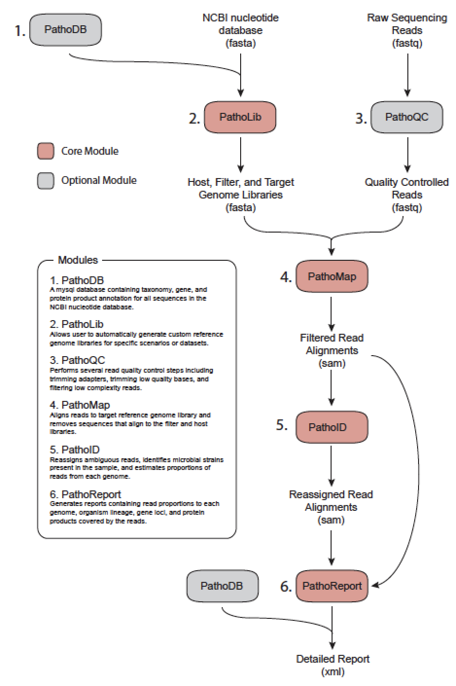
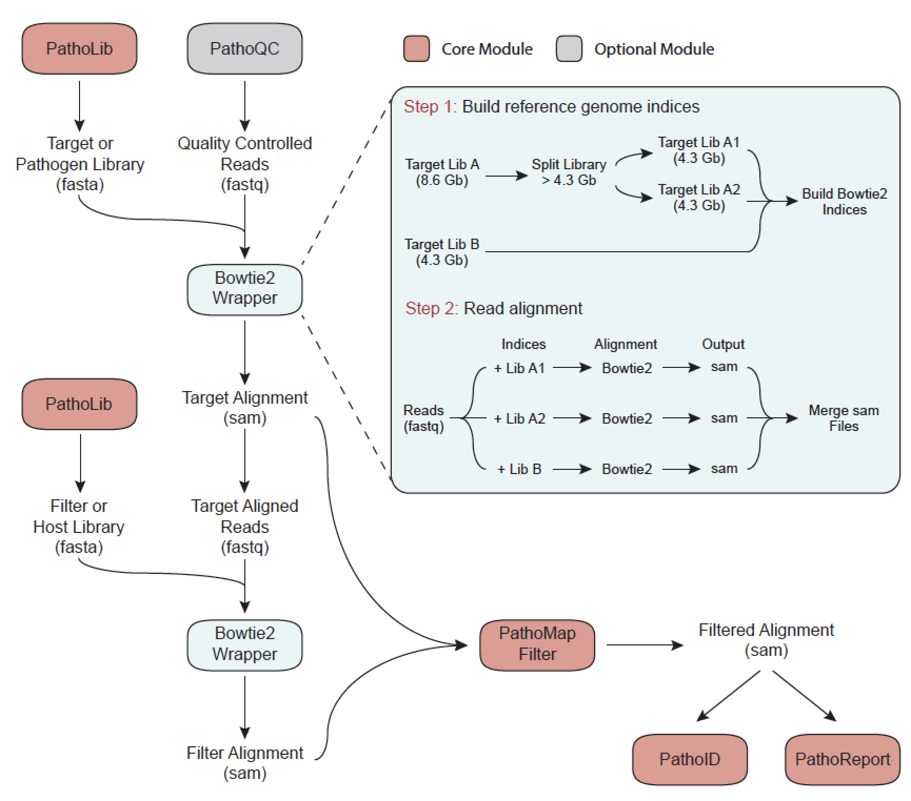

## Introduction to the terminal {.tabset}
Understanding how to use the terminal is a crucial skill needed for conducting bioinformatics analyses. Many programs are newly developed by sciencists, not programmers, so using 'less-refined' software packages and tools is a requirement. So a basic understanding of Unix is necessary. 

### Basic unix commands
```{r engine='bash', eval=FALSE}
pwd
cd ~/github/microbiome_tutorial/
ls
cd fastq_data
ls
cd ..
cp combined.fasta combined2.fasta
mv  combined2.fasta genome/
cd genome
rm combined2.fasta
less combined.fasta #tab completion
less -S combined.fasta #tab completion
```

### Get started
```{r engine='bash', eval=FALSE}
# Make a new directory with your name
cd ~/Desktop/microbiome_tutorial/
mkdir results
```


## Read quality control and trimming {.tabset}
### FASTQC example
FASTQC (https://www.bioinformatics.babraham.ac.uk/projects/fastqc/) is a great tool for summarizing evaluating your data from a .Fastq file. Quoting their website: 

"FastQC aims to provide a simple way to do some quality control checks on raw sequence data coming from high throughput sequencing pipelines. It provides a modular set of analyses which you can use to give a quick impression of whether your data has any problems of which you should be aware before doing any further analysis."

The main functions of FastQC are: 1. Import of data from BAM, SAM or FastQ files (any variant); 2. Providing a quick overview to tell you in which areas there may be problems; 3. Summary graphs and tables to quickly assess your data; 4. Export of results to an HTML based permanent report; 5. Offline operation to allow automated generation of reports without running the interactive application"

Here is a simple example on how to run FASTQC on one or more files! 

```{r engine='bash', eval=FALSE}
## Run a single files
./software/FastQC/fastqc fastq_data/SRR1204622.trim.fastq.gz

## Run all the files
./software/FastQC/fastqc fastq_data/SRR*.trim.fastq.gz
```


### MutltiQC
MultiQC (https://multiqc.info) is the best way to summarize multiple FASTQC result files at the same time. However, I am not giving you an example here, because it can't be simply installed in this folder, and unfortunately, I don't know how to use it :-), my students always just do this for me ;-). 


### Trimmomatic example
Trimmomatic (http://www.usadellab.org/cms/?page=trimmomatic) is a simple Java based tool for QC and trimming your sequencing reads. Below is an example for single end reads (SE; compared to paired end PE), PRED33 encoding (-pred33), triming the tails of low quality reads with a sliding window of size 4 with an average PHRED score of 20 (SLIDINGWINDOW:4:20)--when a window of 4 bases has an average score <20 it trims the rest of the read, trimming the first 3 bases (LEADING:3) and last 3 bases (TRAILING:3) of the read, and removing any reads shorter than 36 bases (MINLEN:36). 

```{r engine='bash', eval=FALSE}
java -jar software/Trimmomatic-0.36/trimmomatic-0.36.jar SE -phred33 fastq_data/SRR1204622.fastq fastq_data/SRR1204622.trim.fastq SLIDINGWINDOW:4:20 LEADING:3 TRAILING:3 MINLEN:36
```

## Downloading a reference genome library in R {.tabset}
Using our MetaScope package tools!

### Installation
```{r, eval=FALSE}
install.packages("devtools")
devtools::install_github("compbiomed/MetaScope")

```

### Download all RefSeq reference bacterial genomes
```{r, eval=FALSE}
library("MetaScope")
download_refseq('bacteria')
```


### Download all RefSeq representative viral genomes
```{r, eval=FALSE}
library("MetaScope")
download_refseq( 'viral', representative = TRUE )
``` 

### Download all RefSeq viral genomes
```{r, eval=FALSE}
library("MetaScope")
download_refseq( 'viral', reference = FALSE ) 
```

## Running PathoScope
Here is a detailed look at the PathoScope workflow:



####Set up a Unix/Mac shortcut for Pathoscope
```{r engine='bash', eval=FALSE}
# make an alias for Pathoscope
alias pathoscope="~/Desktop/microbiome_tutorial/software/pathoscope2/pathoscope/pathoscope.py"

# start in the tutorial directory
cd ~/Desktop/microbiome_tutorial/
```

## Aligning to the reference genome with PathoMAP {.tabset}
USAGE: pathoscope MAP -U $readfile -indexDir $indDir -targetRefFiles $index_fna -expTag $sample -outDir $outDir -btHome $bthome

Here is the PathoMAP workflow:




### PathoScope reference genome format
```{r engine='bash', eval=FALSE}
less -S genome/combined.fasta
less -S genome/combined_pathoscope.fasta
```

### Format for PathoMAP
Only needed if you don't already have a PathoScope formatted .fastq file
```{r, eval=FALSE}
library(Biostrings)
## Function to format genome libraries for PathoScope
format_pathoscope=function(ref_lib){
  ref = readDNAStringSet(ref_lib)
  accession=NULL; fullname=NULL; taxid=NULL
  for (i in strsplit(names(ref),' ')){
    accession=c(accession,i[1])
    fullname=c(fullname,paste(i[-1],collapse='_'))
    if(paste("doc_",i[2],"_",i[3],"_db_refseq.tsv",sep='') %in% allfiles){taxid=c(taxid,read.table(paste("doc_",i[2],"_",i[3],"_db_refseq.tsv",sep=''),header=T,sep="\t")$taxid)}else{taxid=c(taxid,99999)}
  }
  names(ref)=paste("ti|",taxid,"|accession|",accession,"|org|",fullname,sep='')
  writeXStringSet(ref, paste("pathoscope_",ref_lib,sep=''))
}

#setwd("~/Desktop/microbiome_tutorial/genome_test/")
#format_pathoscope("fasta/Staphylococcus_epidermidis_genomic_refseq.fna")
#format_pathoscope("combined.fasta")
```


### Aligning to bacterial genomes
```{r engine='bash', eval=FALSE}
pathoscope MAP --help

bthome=~/Desktop/microbiome_tutorial/software/bowtie2-2.1.0  # bowtie2 home directory
outDir=~/Desktop/microbiome_tutorial/results # set output to your home directory
sample=sample_622 # name the sample
reads=~/Desktop/microbiome_tutorial/fastq_data/SRR1204622.trim.fastq.gz  # read file
indDir=~/Desktop/microbiome_tutorial/genome/bowtie_bacteria_small # reference library location
index_fna=~/Desktop/microbiome_tutorial/genome/bowtie_bacteria_small/combined_pathoscope.fasta # reference fasta location

echo $bthome # print variables
echo $reads
less -S $reads

# Run PathoMap: small index
pathoscope MAP -U $reads -indexDir $indDir -targetRefFiles $index_fna -expTag $sample -outDir $outDir -btHome $bthome

# Output in .sam file
less -S evan/outalign.sam
```

## Removing ambiguity with PathoID {.tabset}
USAGE: pathoscope ID -alignFile $outalign.sam -outDir $outDir -expTag $sample  

We use a Bayesian mixture modeling approach to remove abiguity in read mapping:


#### Estimating the proportions of reads to each bacteria
```{r engine='bash', eval=FALSE}
pathoscope ID --help

outDir=~/Desktop/microbiome_tutorial/results # set output to your home directory
sample=sample_622 # name the sample

# Run PathoID to simmarize sam file 
pathoscope ID -alignFile $outDir/outalign.sam -outDir $outDir -expTag $sample --noUpdatedAlignFile 
```

## Running Pathoscope on a cluster
####Running multiple jobs on SCC (batch)
```{r engine='bash', eval=FALSE}
#!/bin/bash -l

# Set SCC project
#$ -P johnsonlab

# Specify hard time limit for the job. 
#   The job will be aborted if it runs longer than this time.
#   The default time is 12 hours
#$ -l h_rt=12:00:00

# Send an email when the job finishes or if it is aborted (by default no email is sent).
#$ -m ae

# Give job a name
#$ -N TB_biomarker

# Request eight cores
#$ -pe omp 8

# Combine output and error files into a single file
#$ -j y

# Specify the output file name
#$ -o TB_biomarker.qlog

# Submit an array job with n tasks
#$ -t 1-60

# Use the SGE_TASK_ID environment variable to select the appropriate input file from bash array
# Bash array index starts from 0, so we need to subtract one from SGE_TASK_ID value
inputs=(*_tmp"/")
index=$(($SGE_TASK_ID-1))
taskinput=${inputs[$index]}

# Keep track of information related to the current job
echo "=========================================================="
echo "Start date : $(date)"
echo "Job name : $JOB_NAME"
echo "Job ID : $SGE_TASK_ID"
echo "=========================================================="

module load bowtie2/2.3.2
module load python/2.7.13
pathoscope="/restricted/projectnb/pathoscope/code/PathoScope/pathoscope/pathoscope2.py"

dataDir=$taskinput
reads1=$dataDir*.fastq
eTag=${taskinput:0:10} 
indDir="/restricted/projectnb/pathoscope/reflib/index"
targLibs="bacteria_ti_0,bacteria_ti_1,fungi_nt_ti"

$pathoscope MAP -U $reads1 -indexDir $indDir -targetIndexPrefixes $targLibs -expTag $eTag -outDir $dataDir

rm $dataDir$eTag*.sam

$pathoscope ID -expTag $eTag -alignFile $dataDir"outalign.sam" --noUpdatedAlignFile -outDir $dataDir
```

## animalcules analysis and visualization {.tabset}
Screenshot examples of PathoStat:


### View PathoScope results
```{r engine='bash', eval=FALSE}
outDir=~/Desktop/microbiome_tutorial/results # set output to your home directory

cd $outDir 

less -S $outDir/sample_622-sam-report.tsv
```

### Install animalcules
```{r, eval=FALSE}
### Bioconductor version
if (!requireNamespace("BiocManager", quietly = TRUE))
    install.packages("BiocManager")
BiocManager::install("animalcules")

### For the latest updates (USE THIS ONE!)
devtools::install_github("compbiomed/animalcules")
```


### Run animalcules interactively
```{r, eval=FALSE}
library(animalcules)
run_animalcules()
```
##

